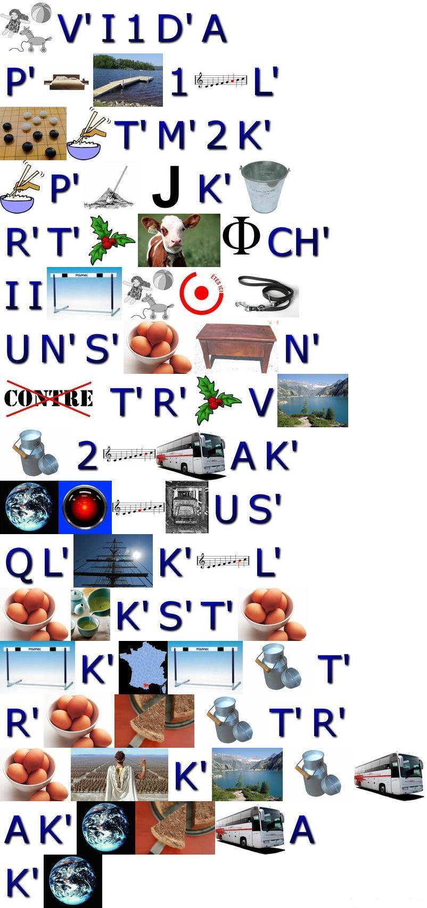
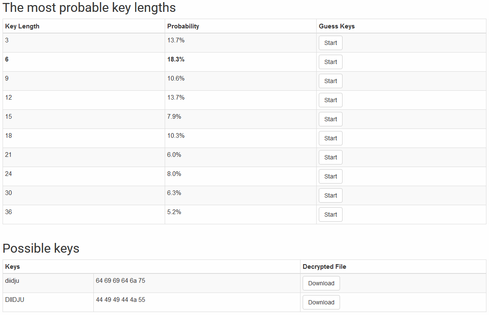

bruteforce-xor

# 1. Introduction
`bruteforce-xor` fait partie d'un projet étudiant consistant à déchiffrer une série de fichiers chiffrés à l'aide d'un ransomware par un pirate informatique nommé Pato Hacker. 

# 2. Indice sur la clé
Pato Hacker à laissé un mail contenant un rébus que voici :



Ce rébus peut être déchiffré tel quel :

"Je viens d'appliquer un algorithme de cryptage sur tout vos fichiers je vous laisse une semaine pour trouver la clé de 6 caractères alpha miniscule maxi le texte est codé lettre par lettre avec la clé caractère par caractère"

Ce message nous apprend donc que la clé de chiffremennt fait 6 lettres minuscule et que le chiffrement utilisé est le `xor`.

# 3. Premier réflexe
Dans ma routine de challenges cryptographique en cybersécurité, j'utilise le site web [Wiremask](https://wiremask.eu/tools/xor-cracker/) pour résoudre les challenges comprenant un `xor`. J'ai donc mis à analyser un fichier, le fichier `PE.txt` choisis arbitrairement, et voici ce que l'outil m'a trouvé :



Grâce à de l'analyse fréquentielle le site a trouvé une clé en minuscule de taille 6 `diidju`.
J'ai ensuite utilisé [xorpy](https://github.com/ShawnDEvans/xorpy) de ShawnDEvans pour déchiffrer tous les fichiers avec la clé trouvé précédemment.

J'ai pu ainsi trouvé le message du Hacker se trouvant dans le fichier `PI.txt`:
```
/******************************************************************************************************************************** 
BRAVO !!! PATOHACKER VOUS FELICITE - VOUS VENEZ DE TROUVER LA CLE ET L'ADRESSE MAIL A LA QUELLE ENVOYER L'ANNULATION DE LA RANCON
MERCI D'ENVOYER A CETTE ADRESSE - exiabadcompany@gmail.com - ET EN COPIE VOTRE PILOTE EN CENTRE LA CLE DE DECRYPTAGE TROUVEE AINSI
QUE CE MESSAGE - "L'informatique est géniale: les e-mails, même si vous n'y répondez pas, ça ne prend pas de place. (Alain Rémond)"
*********************************************************************************************************************************/
```

# 4. Développement de bruteforce-xor

Après avoir trouvé le message j'ai décidé de développer `bruteforce-xor` pour me permettre de déchiffrer la clé.

## a. Difficulté rencontré
Je me suis heurté plusieurs à l'encodage des fichiers. En effet les fichiers ne sont pas encodé en `UTF-8` ou en `ASCII` mais en `ANSI`.
Ce codec m'a forcé à passer mon texte en bytes pour pouvoir le déchiffrer.

## b. Stratégie de déchiffrement


