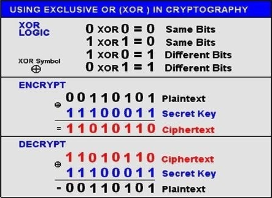
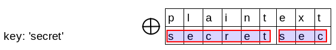
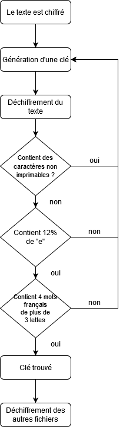

bruteforce-xor

# 1. Introduction
`bruteforce-xor` fait partie d'un projet étudiant consistant à déchiffrer une série de fichiers chiffrés à l'aide d'un ransomware par un pirate informatique nommé Pato Hacker. 

# 2. Indice sur la clé
Pato Hacker à laissé un mail contenant un rébus que voici :


Ce rébus peut être déchiffré tel quel :

"Je viens d'appliquer un algorithme de cryptage sur tout vos fichiers je vous laisse une semaine pour trouver la clé de 6 caractères alpha miniscule maxi le texte est codé lettre par lettre avec la clé caractère par caractère"

Ce message nous apprend donc que la clé de chiffremennt fait 6 lettres minuscule et que le chiffrement utilisé est le `xor`.

# 3. Premier réflexe
Dans ma routine de challenges cryptographique en cybersécurité, j'utilise le site web [Wiremask](https://wiremask.eu/tools/xor-cracker/) pour résoudre les challenges comprenant un `xor`. J'ai donc mis à analyser un fichier, le fichier `PE.txt` choisis arbitrairement, et voici ce que l'outil m'a trouvé :


Grâce à de l'analyse fréquentielle le site a trouvé une clé en minuscule de taille 6 `diidju`.
J'ai ensuite utilisé [xorpy](https://github.com/ShawnDEvans/xorpy) de ShawnDEvans pour déchiffrer tous les fichiers avec la clé trouvé précédemment.

J'ai pu ainsi trouvé le message du Hacker se trouvant dans le fichier `PI.txt`:
```
/******************************************************************************************************************************** 
BRAVO !!! PATOHACKER VOUS FELICITE - VOUS VENEZ DE TROUVER LA CLE ET L'ADRESSE MAIL A LA QUELLE ENVOYER L'ANNULATION DE LA RANCON
MERCI D'ENVOYER A CETTE ADRESSE - exiabadcompany@gmail.com - ET EN COPIE VOTRE PILOTE EN CENTRE LA CLE DE DECRYPTAGE TROUVEE AINSI
QUE CE MESSAGE - "L'informatique est géniale: les e-mails, même si vous n'y répondez pas, ça ne prend pas de place. (Alain Rémond)"
*********************************************************************************************************************************/
```

# 4. Développement de bruteforce-xor

Après avoir trouvé le message j'ai décidé de développer `bruteforce-xor` pour me permettre de déchiffrer la clé.

## a. Difficulté rencontré
Je me suis heurté plusieurs fois à l'encodage des fichiers. En effet les fichiers ne sont pas encodé en `UTF-8` ou en `ASCII` mais en `ANSI`.
Ce codec m'a forcé à passer mon texte en bytes pour pouvoir le déchiffrer.

## b. Stratégie de déchiffrement
### Chiffrement / déchiffrement xor
Le chiffrement xor est un chiffrement se faisant caractère par caractère du message et caractère par caractère de la clé. Comme l est symétrique, pour déchiffrer il suffit de rejouer la fonction de chiffrement avec la clé.
Voici son principe :



Lorsque le message est plus grand que la clé, nous répétons la clé x fois dans le message :



Dans bruteforce-xor c'est ma fonction `xor()` qui va se charger de faire matcher les caractères en bytes du message :

```
def xor(data, key):
    return bytes(a ^ b for a, b in zip(data, itertools.cycle(key)))
```

### Brute-force

Pour bruteforce la clé de chiffrement j'utilise la fonction `product` de `itertools` qui me génère tous les possibilité de clé de 6 caractères alpha minuscule.
Le nombre de possibilité de clé contenu entre `aaaaaa` et `zzzzzz` est de : 26<sup>6</sup> = 308915776
Ma clé quant à elle se trouve à la position : 4\*26<sup>5</sup>+9\*26<sup>4</sup>+9\*26<sup>3</sup>+4\*26<sup>2</sup>+10\*26<sup>1</sup>+21 = 51799457

#### Première version
Dans la première version du code j'utilisais le dictionnaire de 23000 mots `liste_francais.txt` pour vérifier à chaque clé si dans mon texte déchiffrer il y avait au moins 10 mots français. Avec cette méthode je résolvais 0.5 clé à la minute soit pour trouver ma clé il me fallait : 103598914 minutes soit un peu plus de 197 ans.
Les points qui était à améliorer dessus était de ne pas utiliser un dictionnaire de 23000 mots car beaucoup trop long à parcourir. De plus il fallait trouver d'autre méthode pour réduire au maximum le nombre de requête au dictionnaire.

#### Deuxième version du code
Pour réduire ce temps estimé de 197 ans, j'ai mis en place des méchanismes d'analyses fréquentielles et j'ai réduis le déchiffrement aux 100 premiers caractères du texte uniquement pour trouver la clé. 

J'ai commencé par me baser sur le fais que si mon texte est déchiffré il ne devrait pas contenir de caractères non imprimable. 
Caractère imprimable :
```
0123456789abcdefghijklmnopqrstuvwxyzàáâäãåæçéèêëíìîïñóòôöõœúùûüABCDEFGHIJKLMNOPQRSTUVWXYZÀÁÂÄÃÅÆÇÉÈÊËÍÌÎÏÑÓÒÔÖÕŒÚÙÛÜ!"#$%&\'()*+,-./:;?@[\\]^_`{|}~ \t\n\r\x0b\x0c
```

Ensuite si mon texte contient uniquement des caractères imprimables je vérifie le pourcentage de `e` à l'intérieur de celui ci. Il y a 12% de `e` en français. si mon etrait de texte déchiffré contient moins de 12 "e" c'est sans doute que mon texte n'a pas été déchiffré.

J'ai finis par réduire le dictionnaire de 23000 mots aux 2000 mots les plus fréquent dans la langue française. (cf. [Listes de fréquence/wortschatz-fr-1-2000](https://fr.wiktionary.org/wiki/Wiktionnaire:Listes_de_fr%C3%A9quence/wortschatz-fr-1-2000)).
Je termine par vérifier si mon texte contient au moins 4 mots français de plus de 3 lettres.

Si une seule de ces 3 étapes n'a pas été validé, la clé essayé est passé. Si les 3 étapes sont validées, alors l'algorithme à sans doute trouver la clé et peut déchiffrer tous les autres fichiers.

Voici un diagramme représentant la partie analyse du bruteforce :



### Résultats
Avec cette deuxième méthode, j'ai considérablement augmenté les performances de l'algorithme. L'algorithme effectue 100000 essais de clé toute les 11 secondes environ ce qui fait environ 545454 clé par minutes soit pour trouver la clé `diidju` 1h 30min 48sec et 9h 25min 48sec pour effectuer les 308915776 possibilités.
Cette ordre de grandeur reste viable dans la limite du projet car ce qui étaitç demandé est de déchiffrer en moins d'une semaine les fichiers et trouver le message.

En réalité, après exécution du code nous trouvons la clé en 4450 secondes soit 1h 14 min et 24sec car j'ai effectué mes statistique sur les 100000 premières clés qui ne représentent pas un ensemble assez grand pour calculer avec précision de le temps necessaire au déchiffrement.

### Points d'améliorations
Pour réduire encore le temps pour trouver la clé et réduire le passaage au dictionnaire, nous pouvons mettre en place d'autres mécanismes en plus de ceux présents :
* Analyse des digrammes : En français certaines suites de lettres n'existe pas, si ces suites sont présentes alors la clé est invalidé
* Analyse des voyelles : Chaque mot à au moins une voyelle sauf si la lettre est toute seule ou si c'est un caractère de ponctuation.
* Analyse du pourcentage de ponctuation : Si pourcentage supérieur à 5% alors la clé n'est surementment pas bonne (Chiffre trouvé après analyse du livre `Le Tour du monde en quatre-vingts jours - Jules Verne`)
* Bruteforce uniquement avec un caractère et non toute la clé : en calculant la distance de hamming nous pourrions trouver le n-gram du text et définir une taille de clé. Ensuite en testant caractère par caractère au lieu de toute la clé nous pourrions trouver les caractères qui déchiffre le message ainsi que leurs positionnement dans la clé.